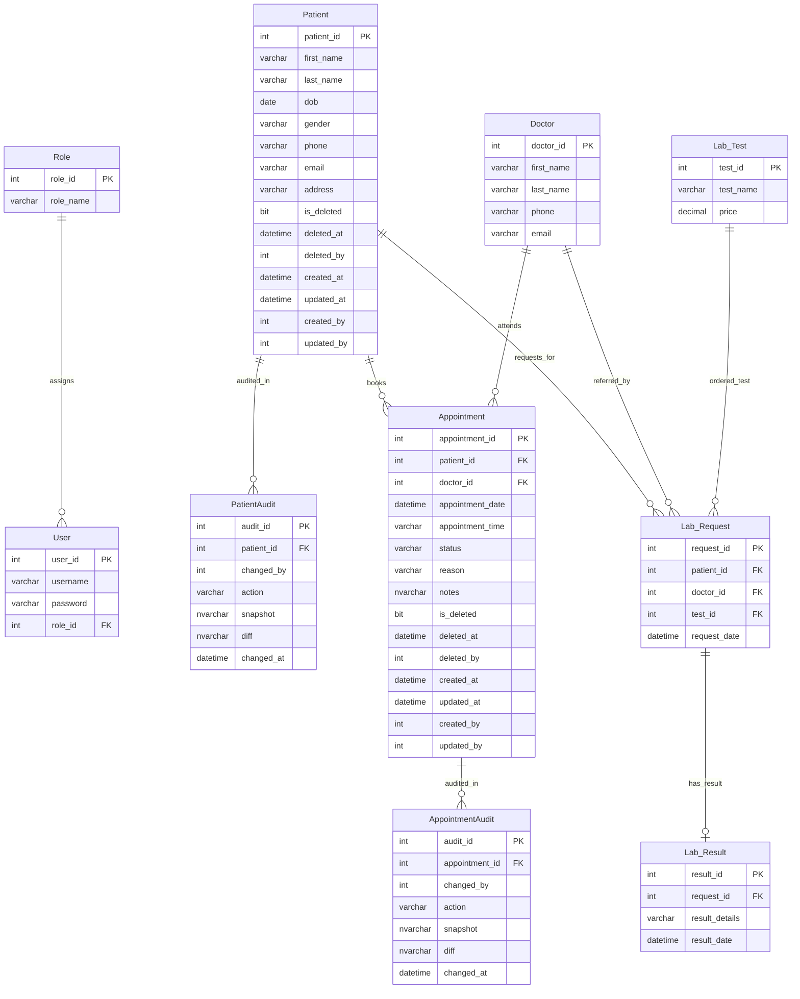

# SHIIS Final System Report

## Project Overview

**SHIIS (Smart Healthcare & Inventory Intelligence System)** is a full-stack healthcare platform designed to manage core hospital/clinic workflows with strong focus on data consistency, traceability, and operational efficiency.

This implementation includes:

- Backend API built with **NestJS + TypeORM + SQL Server**
- Frontend web app built with **React (Vite)**
- Role-oriented operational modules (patient, appointment, lab, users/auth)
- Soft-delete and audit-friendly design patterns
- SQL migration-based schema evolution

---

## Implemented Core Modules

### 1. Authentication & User Management
- User/role-capable backend architecture
- Protected app areas through frontend route guards
- Action attribution fields (`created_by`, `updated_by`, `deleted_by`) across major entities

### 2. Patient Management
- Patient create/read/update/delete (soft delete)
- Search and pagination support
- Additional patient metadata support
- Patient audit support structures

### 3. Appointment Management
- Appointment scheduling and updates
- Patient linkage and doctor linkage via `doctor_id`
- Status lifecycle support (`Scheduled`, `Completed`, `Cancelled`, `No Show`, `Booked`)
- Pagination, filtering, sorting, and soft-delete behavior
- Appointment audit trail support
- Frontend enhancements:
  - Doctor select dropdown
  - Date validation (no past booking)
  - Clean doctor label formatting (`Dr.` normalization)

### 4. Lab Management
- Lab request creation and update
- Patient + doctor + test linkage
- Result recording and updates
- Result deletion flow
- Lab test catalog integration

### 5. Medical Imaging Workflow
- Imaging-related workflow integrated for advanced clinical data handling
- Imaging records can be linked to patient and clinical process context
- Supports future extension for image metadata indexing and diagnostic reporting
- Suitable for secure access control and audit tracing

### 6. Reporting & Audit Layer
- Entity-level audit support (`PatientAudit`, `AppointmentAudit`)
- Snapshot + diff style change tracking for historical traceability
- Soft-delete aware reporting approach
- Dashboard/report-ready query patterns

### 7. Data Integrity & Constraint Management
- Status/domain constraints aligned with application business rules
- Foreign key-driven relationships for transactional consistency
- Null/backfill correction workflows through controlled migrations
- Validation enforced at both API and DB levels

### 8. Database Migration Workflow
- Versioned SQL migration files (`V2...V7`)
- Automatic idempotent schema patches (column/index/check safety checks)
- Custom migration runner with `SchemaMigrations` tracking table
- Controlled execution command:
  - `npm run start:migrations` runs pending migrations only
  - Normal backend startup does not auto-run migrations

---

## Major Fixes Completed During Build

- Resolved multiple schema/entity mismatches in `Appointment`
- Added missing business/audit columns through migration files
- Fixed non-null `doctor_id` insertion failures
- Removed obsolete `doctor_name` DB dependency and aligned app with `doctor_id`
- Standardized UI doctor naming to avoid `Dr. Dr.` duplication
- Fixed status `CHECK` constraint mismatch by normalizing + recreating constraint
- Added timestamp persistence reliability (`createdAt`/`updatedAt`) in service layer
- Added backfill migration for historical null audit/timestamp data

---

## Current Database & Migration Strategy

### Migration Execution Model
- SQL scripts stored in: `backend/src/migrations`
- Applied migrations tracked in: `SchemaMigrations`
- Execution order: filename sort (`V2...V7...`)
- Recommended process:
  1. `npm run start:migrations`
  2. `npm run start:dev`

### Benefits
- Repeatable, auditable schema changes
- Safe for team environments
- Prevents “works on one machine only” drift

---

## Complete ER Diagram (Database-Centric)

Below is the full ER diagram in Mermaid format for documentation and presentation use.

### ER Design Notes (Advanced DBMS Focus)

- **Audit tables** (`PatientAudit`, `AppointmentAudit`) are append-only history entities.
- **Soft-delete pattern** in primary transactional tables preserves history and supports restoration.
- **Lab_Request -> Lab_Result** is modeled as 1:0..1 to represent pending/completed lifecycle.
- **Doctor** is a core referenced table in appointment/lab workflows (even if managed by a separate module/service layer).
- **Status/domain constraints** should be enforced with `CHECK` constraints and validated again at API layer.

---

## Use Stored Procedures For (Recommended)

These are operations where **security, consistency, transactions, and performance** matter most.

- Patient registration
- Appointment booking
- Billing/payment processing
- Prescription saving
- Inventory stock updates
- Report generation
- Audit logging
- Multi-table operations
- Transactions

### Additional Stored Procedures to Add

- Appointment cancellation/reschedule with slot conflict checks
- Doctor availability and slot lock/check procedure
- Patient merge/deduplication workflow
- Lab request + result consolidated save flow
- Invoice generation (header + line items + tax + totals)
- Payment allocation and reversal/refund handling
- Pharmacy dispensing with stock decrement + ledger entry
- Inventory purchase receive + stock batch update
- Reorder alert generation procedure
- Daily operational summary snapshot generation
- KPI dashboard aggregate precompute routines
- Centralized soft-delete/restore procedure per entity
- End-of-day reconciliation procedure
- Archival and retention policy procedure

---

## Recommended Transaction-Critical Procedure Patterns

Use explicit transaction handling in SPs for:

- Registration flows creating patient + related records
- Appointment booking + slot reservation
- Billing + payment + ledger updates
- Prescription + inventory stock movement
- Any operation touching 2+ tables in a single business action

Recommended SQL Server pattern:

- `BEGIN TRY / BEGIN TRAN / COMMIT / END TRY`
- `BEGIN CATCH / ROLLBACK / THROW / END CATCH`
- Validation first, write second
- Return structured status/error codes for API mapping

---

## Security & Data Integrity Recommendations

- Keep all writes through validated API or controlled SPs
- Restrict direct table DML for app users
- Use SP parameterization to prevent SQL injection
- Add unique and check constraints for domain safety
- Keep audit tables append-only
- Include actor/user context on business-critical writes

---

## Tab-by-Tab Final Report (Advanced DBMS Focus)

This section documents each UI tab/module as required for the Advanced Database Management System module.

### 1. Dashboard Tab (`/`)

**Purpose**
- Operational overview of system activity and KPIs.

**Database Focus**
- Aggregation queries across transactional tables (Appointments, Lab, Patients).
- Read-heavy workload suitable for summary views/materialized reporting tables.

**Recommended Stored Procedures**
- `sp_GetDashboardStats`
- `sp_GetRecentAppointments`
- `sp_GetLabPendingCount`
- `sp_GetDailyOperationalSnapshot`

**Advanced DBMS Notes**
- Prefer pre-aggregated snapshots for performance at scale.
- Add indexed date dimensions for trend queries.

---

### 2. Patients Tab (`/patients`, `/patients/new`, `/patients/:id`, `/patients/:id/edit`)

**Purpose**
- Manage patient master records and patient profile lifecycle.

**Core Tables**
- `Patient`
- `PatientAudit`

**Operations**
- Create patient
- Update patient
- Soft delete patient
- List/search/paginate patients
- View patient profile details
- Audit trail capture

**Recommended Stored Procedures**
- `sp_RegisterPatient`
- `sp_UpdatePatient`
- `sp_SoftDeletePatient`
- `sp_GetPatientPaged`
- `sp_GetPatientById`
- `sp_GetPatientAuditHistory`
- `sp_FindDuplicatePatients` (already aligned with your prior work direction)

**Advanced DBMS Notes**
- Soft-delete strategy preserves legal/medical traceability.
- Audit table stores snapshot + diff for forensic history.

---

### 3. Doctors Tab (`/doctors`) [Currently Coming Soon]

**Purpose**
- Manage doctor master records used by appointments and lab requests.

**Core Tables**
- `Doctor` (referenced by `Appointment` and `Lab_Request`)

**Recommended Stored Procedures**
- `sp_CreateDoctor`
- `sp_UpdateDoctor`
- `sp_DeactivateDoctor`
- `sp_GetDoctorPaged`
- `sp_GetDoctorAvailabilitySlots`

**Advanced DBMS Notes**
- Doctor identity should be a stable FK target (`doctor_id`).
- Availability logic should be transaction-safe for booking conflicts.

---

### 4. Appointments Tab (`/appointments`, `/appointments/new`, `/appointments/:id`, `/appointments/:id/edit`)

**Purpose**
- Book and manage patient appointments with doctor assignments.

**Core Tables**
- `Appointment`
- `AppointmentAudit`
- References: `Patient`, `Doctor`

**Operations**
- Create appointment
- Update/reschedule appointment
- Soft delete/archive appointment
- Restore appointment
- Status transitions
- Pagination/filter/search/sort
- Audit logging on create/update/delete

**Recommended Stored Procedures**
- `sp_BookAppointment`
- `sp_RescheduleAppointment`
- `sp_CancelAppointment`
- `sp_RestoreAppointment`
- `sp_GetAppointmentPaged`
- `sp_GetAppointmentAuditHistory`
- `sp_CheckDoctorSlotAvailability`

**Advanced DBMS Notes**
- Enforce status domain with `CHECK` constraints.
- Slot booking must be transactional to avoid race conditions.

---

### 5. Prescriptions Tab (`/prescriptions`) [Currently Coming Soon]

**Purpose**
- Store and track patient prescriptions linked to doctor visits.

**Likely Core Tables**
- `Prescription`, `PrescriptionItem`
- References: `Patient`, `Doctor`, optionally `Appointment`, `Medicine`

**Recommended Stored Procedures**
- `sp_SavePrescription`
- `sp_UpdatePrescription`
- `sp_GetPrescriptionById`
- `sp_GetPatientPrescriptionHistory`

**Advanced DBMS Notes**
- Multi-row prescription items require transaction handling.
- Consider immutable signed versions for medico-legal safety.

---

### 6. Inventory Tab (`/inventory`) [Currently Coming Soon]

**Purpose**
- Track medicine stock and inventory movement.

**Likely Core Tables**
- `InventoryItem`, `StockLedger`, `StockBatch`

**Recommended Stored Procedures**
- `sp_StockIn`
- `sp_StockOut`
- `sp_AdjustStock`
- `sp_GetLowStockItems`
- `sp_RecalculateInventoryBalance`

**Advanced DBMS Notes**
- Stock updates should always write ledger entries.
- Strong transaction boundaries required for stock consistency.

---

### 7. Suppliers Tab (`/suppliers`) [Currently Coming Soon]

**Purpose**
- Manage suppliers and purchase order lifecycle.

**Likely Core Tables**
- `Supplier`, `PurchaseOrder`, `PurchaseOrderItem`, `GoodsReceipt`

**Recommended Stored Procedures**
- `sp_CreateSupplier`
- `sp_CreatePurchaseOrder`
- `sp_ReceivePurchaseOrder`
- `sp_ClosePurchaseOrder`

**Advanced DBMS Notes**
- Receiving should atomically update stock + PO balances.
- Include financial reconciliation hooks.

---

### 8. Billing Tab (`/billing`) [Currently Coming Soon]

**Purpose**
- Billing, invoicing, and payment processing.

**Likely Core Tables**
- `Invoice`, `InvoiceItem`, `Payment`, `PaymentAllocation`

**Recommended Stored Procedures**
- `sp_GenerateInvoice`
- `sp_AddInvoiceItems`
- `sp_ProcessPayment`
- `sp_AllocatePayment`
- `sp_ReversePayment`
- `sp_GetOutstandingBalances`

**Advanced DBMS Notes**
- Financial writes must be fully transactional and auditable.
- Strict constraints for overpayment, negative balance, duplicate posting.

---

### 9. Lab Management Tab (`/lab`, `/lab/new`, `/lab/:id`, `/lab/:id/edit`, `/lab/tests`)

**Purpose**
- Manage lab test catalog, test requests, and result reporting.

**Core Tables**
- `Lab_Test`
- `Lab_Request`
- `Lab_Result`
- References: `Patient`, `Doctor`

**Operations**
- Create/edit lab request
- Assign patient/doctor/test
- Save/edit/delete lab result
- View test catalog and request status

**Recommended Stored Procedures**
- `sp_CreateLabRequest`
- `sp_UpdateLabRequest`
- `sp_SaveLabResult`
- `sp_UpdateLabResult`
- `sp_DeleteLabResult`
- `sp_GetLabRequestPaged`
- `sp_GetLabRequestByIdWithResult`

**Advanced DBMS Notes**
- `Lab_Request` to `Lab_Result` modeled as one-to-zero/one lifecycle.
- Result save flow should support optimistic concurrency at scale.

---

### 10. Users Tab (`/users`, `/users/new`, `/users/:id/edit`) [Admin]

**Purpose**
- Administrative user and role assignment management.

**Core Tables**
- `User`
- `Role`

**Operations**
- Create user
- Update user
- Assign role
- List users

**Recommended Stored Procedures**
- `sp_CreateUser`
- `sp_UpdateUser`
- `sp_AssignUserRole`
- `sp_GetUsersPaged`

**Advanced DBMS Notes**
- Role assignment is critical for least-privilege enforcement.
- Password handling remains app-layer hashed; DB stores hash only.

---

### Cross-Tab Shared DB Concerns

**Audit & Compliance**
- Keep append-only audit history for sensitive entities.
- Capture actor ids and timestamps for all critical writes.

**Transactions**
- Use explicit transactions for all multi-table write operations.

**Concurrency**
- Add conflict checks for slot booking, stock updates, and payment allocation.

**Performance**
- Paginated list endpoints should map to indexed sorting/filter columns.

---

## Performance Recommendations

- Index foreign keys and common filter columns
- Use covering indexes for list pages with pagination
- Prefer SPs for heavy report queries
- Add summary/materialized reporting tables for dashboards
- Monitor slow queries and add targeted indexes

---

## Final Status

System foundation is complete and production-oriented in architecture, with robust migration handling and corrected appointment/lab flows.  
Next maturity step should focus on expanding stored procedure coverage for financial, inventory, and cross-module transactional operations.
